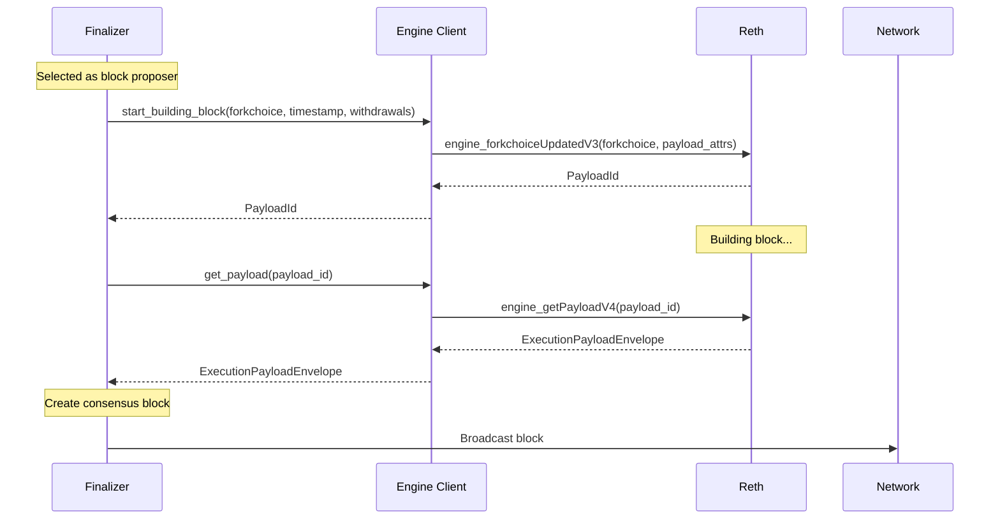
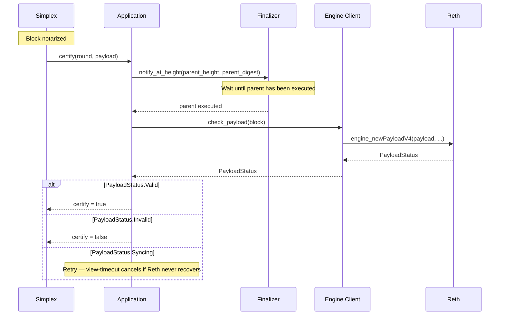
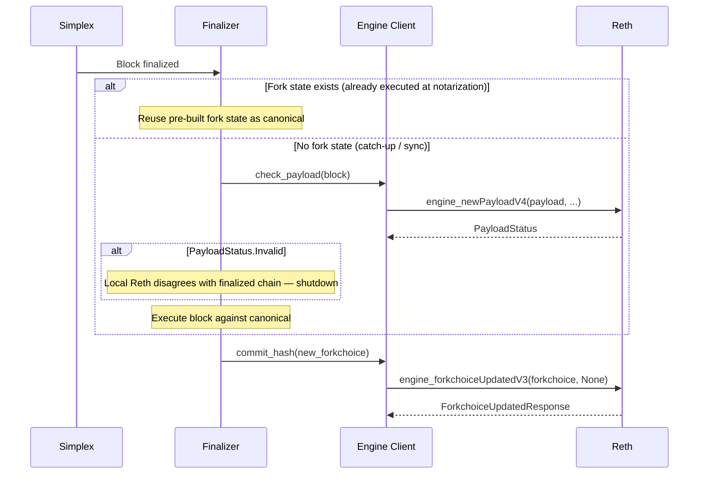

# Engine API Integration

Summit communicates with execution clients (e.g. reth) exclusively through the Engine API. This document details the integration patterns, communication flows, and security considerations for this critical interface.

## Engine API Overview

The Engine API is the standard interface between consensus and execution layers in Ethereum-like systems. Summit acts as the consensus client, while reth handles transaction execution and state management.

```
┌─────────────────┐    Engine API     ┌─────────────────┐
│                 │  ←─────────────→  │                 │
│     Summit      │       (IPC)       │    Reth/Geth    │
│   (Consensus)   │                   │   (Execution)   │
│                 │                   │                 │
└─────────────────┘                   └─────────────────┘
```

## Engine Client Implementation

### Core Interface (`types/src/engine_client.rs`)

Summit defines a generic `EngineClient` trait that abstracts execution client communication:

```rust
pub trait EngineClient: Clone + Send + Sync + 'static {
    fn start_building_block(
        &mut self,
        fork_choice_state: ForkchoiceState,
        timestamp: u64,
        withdrawals: Vec<Withdrawal>,
        suggested_fee_recipient: Address,
        parent_beacon_block_root: Option<FixedBytes<32>>,
    ) -> impl Future<Output = Option<PayloadId>> + Send;

    fn get_payload(
        &mut self,
        payload_id: PayloadId,
    ) -> impl Future<Output = ExecutionPayloadEnvelopeV4> + Send;

    fn check_payload(
        &mut self,
        block: &Block,
    ) -> impl Future<Output = PayloadStatus> + Send;

    fn commit_hash(
        &mut self,
        fork_choice_state: ForkchoiceState,
    ) -> impl Future<Output = ForkchoiceUpdated> + Send;
}
```

### Reth Implementation

The `RethEngineClient` implements the trait using Alloy's Engine API client:

```rust
#[derive(Clone)]
pub struct RethEngineClient {
    engine_ipc_path: String,
    provider: RootProvider,
}
```

**Connection Details:**
- **Transport**: IPC socket (default: `/tmp/reth_engine_api.ipc`)
- **Protocol**: JSON-RPC over IPC
- **Persistence**: Long-lived connection with reconnection logic

## Engine API Methods

### 1. `engine_forkchoiceUpdatedV3`

Updates the execution client's view of the canonical chain and optionally starts building a new block.

### 2. `engine_getPayloadV4`

Retrieves a built block from the execution client. Called shortly after `start_building_block`.

### 3. `engine_newPayloadV4`

Validates and stores a block without committing it to the canonical chain. Used when validating received blocks to verify with execution.

## Communication Patterns

### Block Production Flow



### Block Validation and Certification Flow

`check_payload` is invoked from two places: the Application's `certify` hook, and the Finalizer's block-execution path. Both serve the same goal — ensure the local Reth has validated the payload before any state mutation depends on it. Two call sites are needed because the Finalizer can process blocks for which the local `certify` never ran (described below).

#### Certify (primary gate)

After a block is notarized, Simplex calls `CertifiableAutomaton::certify` on each validator. Summit's implementation calls `check_payload` here. A `certify` quorum (2f+1) is required for a block to become "certified", and `find_parent` only returns certified blocks — so an invalid payload can never become the parent of a future block, and can never reach finalization under an honest 2f+1 majority.



#### Finalizer (covers the case where local certify never ran)

A block can reach the Finalizer for which this validator's `certify` did not run. Two situations:

- **Lagging validator** — only 2f+1 *other* validators are required for the network to certify and finalize a block. A slower validator may receive a notarization or finalization for a block before its own `certify` completes (or starts).
- **Syncing / catch-up** — when a node restarts or joins from a checkpoint, it fetches finalized blocks from peers and applies them directly through the Finalizer. The Simplex engine does not run for those historical epochs, so `certify` is never invoked for them.

In both cases, the Finalizer must call `check_payload` itself before mutating consensus state or advancing Reth's head. Two paths:

- **`handle_notarized_block`** — clones the parent state and executes the block to build a fork state. If `check_payload` returns INVALID, the fork state is discarded and `commit_hash` is not called. The block is left for `certify` to formally reject.
- **`handle_finalized_block` (catch-up)** — no fork state exists for this block (the validator missed notarization or is syncing). The Finalizer executes against canonical state directly. If `check_payload` returns INVALID, the local Reth disagrees with a chain the rest of the network has finalized — the validator shuts down rather than commit an inconsistent state.

When a fork state already exists at finalization (the common steady-state path), the Finalizer reuses it; `check_payload` was already called at notarization, so no duplicate work is needed.

### Finalization Flow



## Error Handling

### Engine API Errors

The Engine API can return several types of errors that Summit must handle. These include:

1. **Invalid State**: Execution client rejects forkchoice update
   - **Cause**: Invalid block hash or inconsistent state
   - **Handling**: Log error and continue with current state

2. **Syncing State**: Execution client is syncing
   - **Cause**: Client behind or processing large state changes
   - **Handling**: Wait and retry operation

3. **Connection Errors**: IPC/network issues
   - **Cause**: Socket errors, timeouts, or client restarts
   - **Handling**: Reconnect and retry with backoff

## Security Considerations

### Authentication

Engine API communication is secured using a unix socket inside the secure VM. We feel this is safer then using http secured with a JWT. We use `alloy` for this:

```rust
let provider = ProviderBuilder::default().connect_ipc(ipc).await?;
```

## Monitoring and Observability

**Metrics**: Summit uses Prometheus to collect metrics (enabled with `feature = "prom"`)

**Logging**: Summit uses the `tracing` crate for logging

**Health Checks**: Summit exposes a JSON-RPC API bound to port 3030 by default. The health check is the `health` RPC method, which currently returns `"Ok"`.
