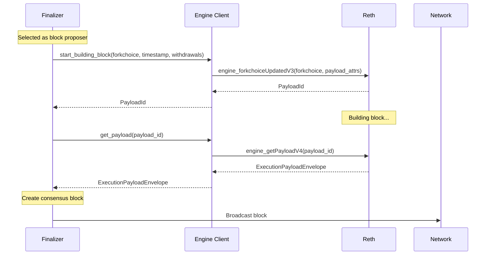
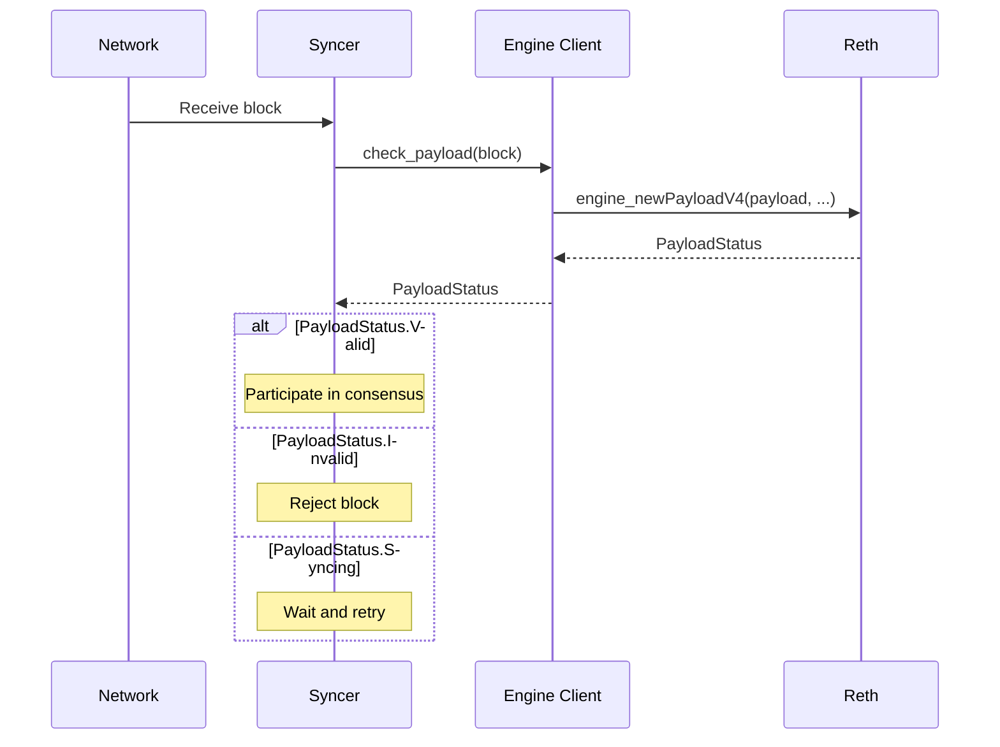
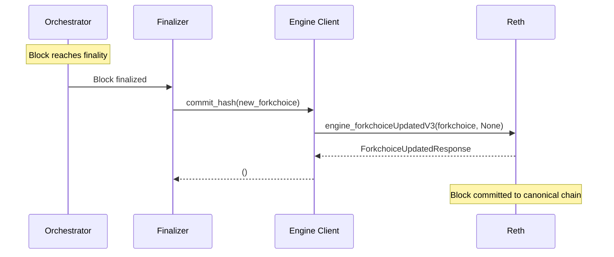

# Engine API Integration

Summit communicates with execution clients (Reth, Geth) exclusively through the Engine API. This document details the integration patterns, communication flows, and security considerations for this critical interface.

## Engine API Overview

The Engine API is the standard interface between consensus and execution layers in Ethereum-like systems. Summit acts as the consensus client, while Reth/Geth handle transaction execution and state management.

```
┌─────────────────┐    Engine API     ┌─────────────────┐
│                 │ ←─────────────→   │                 │
│ Summit          │     (IPC)         │ Reth/Geth       │
│ (Consensus)     │                   │ (Execution)     │
│                 │                   │                 │
└─────────────────┘                   └─────────────────┘
```

## Engine Client Implementation

### Core Interface (`types/src/engine_client.rs`)

Summit defines a generic `EngineClient` trait that abstracts execution client communication:

```rust
pub trait EngineClient: Clone + Send + Sync + 'static {
    fn start_building_block(
        &self,
        fork_choice_state: ForkchoiceState,
        timestamp: u64,
        withdrawals: Vec<Withdrawal>,
    ) -> impl Future<Output = Option<PayloadId>> + Send;

    fn get_payload(
        &self,
        payload_id: PayloadId,
    ) -> impl Future<Output = ExecutionPayloadEnvelopeV4> + Send;

    fn check_payload<C: Signer, V: Variant>(
        &self,
        block: &Block<C, V>,
    ) -> impl Future<Output = PayloadStatus> + Send;

    fn commit_hash(
        &self, 
        fork_choice_state: ForkchoiceState
    ) -> impl Future<Output = ()> + Send;
}
```

### Reth Implementation

The `RethEngineClient` implements the trait using Alloy's Engine API client:

```rust
#[derive(Clone)]
pub struct RethEngineClient {
    provider: RootProvider,
}

impl RethEngineClient {
    pub async fn new(engine_ipc_path: String) -> Self {
        let ipc = IpcConnect::new(engine_ipc_path);
        let provider = ProviderBuilder::default()
            .connect_ipc(ipc)
            .await
            .unwrap();
        Self { provider }
    }
}
```

**Connection Details:**
- **Transport**: IPC socket (default: `/tmp/reth_engine_api.ipc`)
- **Protocol**: JSON-RPC over IPC
- **Authentication**: JWT tokens for secure communication
- **Persistence**: Long-lived connection with reconnection logic

## Engine API Methods

### 1. `engine_forkchoiceUpdatedV3`

**Purpose**: Updates the execution client's view of the canonical chain and optionally starts building a new block.

```rust
async fn start_building_block(
    &self,
    fork_choice_state: ForkchoiceState,
    timestamp: u64,
    withdrawals: Vec<Withdrawal>,
) -> Option<PayloadId> {
    let payload_attributes = PayloadAttributes {
        timestamp,
        prev_randao: [0; 32].into(),
        suggested_fee_recipient: [1; 20].into(),
        withdrawals: Some(withdrawals),
        parent_beacon_block_root: Some([1; 32].into()),
    };
    
    let res = self.provider
        .fork_choice_updated_v3(fork_choice_state, Some(payload_attributes))
        .await
        .unwrap();
    
    res.payload_id
}
```

**Usage Scenarios:**

1. **Block Production Start**: When validator is selected to propose
   ```rust
   // In finalizer when starting block production
   let payload_id = engine_client.start_building_block(
       fork_choice_state,
       block_timestamp,
       pending_withdrawals
   ).await;
   ```

2. **Finality Commitment**: When block reaches finality
   ```rust
   // In finalizer when committing finalized block
   engine_client.commit_hash(new_fork_choice_state).await;
   ```

### 2. `engine_getPayloadV4`

**Purpose**: Retrieves a built block from the execution client. Called shortly after start_building block

```rust
async fn get_payload(&self, payload_id: PayloadId) -> ExecutionPayloadEnvelopeV4 {
    self.provider.get_payload_v4(payload_id).await.unwrap()
}
```

**Usage Pattern:**
```rust
// After starting block building, retrieve the payload
let payload_id = engine_client.start_building_block(...).await?;
// Wait for block to be built...
let envelope = engine_client.get_payload(payload_id).await;
let execution_payload = envelope.execution_payload;
```

### 3. `engine_newPayloadV4`

**Purpose**: Validates and stores a block without committing it to the canonical chain. Used when validitating received blocks to verify with execution

```rust
async fn check_payload<C: Signer, V: Variant>(
    &self, 
    block: &Block<C, V>
) -> PayloadStatus {
    self.provider
        .new_payload_v4(
            block.payload.clone(),
            Vec::new(),                    // versioned_hashes
            [1; 32].into(),               // parent_beacon_block_root
            block.execution_requests.clone(),
        )
        .await
        .unwrap()
}
```

**Validation Flow:**
```rust
// When receiving block from network
let status = engine_client.check_payload(&received_block).await;
match status.status {
    PayloadStatusEnum::Valid => {
        // Block is valid, participate in consensus
    },
    PayloadStatusEnum::Invalid => {
        // Block is invalid, reject
    },
    PayloadStatusEnum::Syncing => {
        // Execution client is syncing, wait
    }
}
```

## Communication Patterns

### Block Production Flow



### Block Validation Flow



### Finalization Flow



## Error Handling

### Engine API Errors

The Engine API can return several types of errors that Summit must handle:

```rust
impl EngineClient for RethEngineClient {
    async fn start_building_block(...) -> Option<PayloadId> {
        let res = self.provider
            .fork_choice_updated_v3(fork_choice_state, Some(payload_attributes))
            .await
            .unwrap();

        if res.is_invalid() {
            error!("invalid returned for forkchoice state {fork_choice_state:?}: {res:?}");
            return None;
        }
        
        if res.is_syncing() {
            warn!("syncing returned for forkchoice state {fork_choice_state:?}: {res:?}");
            return None;
        }

        res.payload_id
    }
}
```

**Error Categories:**

1. **Invalid State**: Execution client rejects forkchoice update
   - **Cause**: Invalid block hash or inconsistent state
   - **Handling**: Log error and continue with current state

2. **Syncing State**: Execution client is syncing
   - **Cause**: Client behind or processing large state changes
   - **Handling**: Wait and retry operation

3. **Connection Errors**: IPC/network issues
   - **Cause**: Socket errors, timeouts, or client restarts
   - **Handling**: Reconnect and retry with backoff

### Retry Logic

Summit implements retry logic for transient failures:

```rust
// Pseudocode for retry pattern
async fn retry_engine_call<F, T>(operation: F, max_retries: u32) -> Result<T>
where
    F: Fn() -> Future<Output = Result<T>>,
{
    for attempt in 0..max_retries {
        match operation().await {
            Ok(result) => return Ok(result),
            Err(e) if is_retryable(&e) => {
                tokio::time::sleep(backoff_duration(attempt)).await;
                continue;
            },
            Err(e) => return Err(e),
        }
    }
    Err("Max retries exceeded")
}
```

## Security Considerations

### Authentication

Engine API communication is secured through usinc a unix socket inside the secure VM. We feel this is safer then using http secured with a JWT

```rust
// JWT authentication configured in provider
let provider = ProviderBuilder::default()
    .connect_ipc_with_auth(ipc)
    .await?;
```

## Monitoring and Observability

### Metrics

Summit tracks Engine API performance metrics:

```rust
// Example metrics (implementation in prom module)
- engine_api_request_duration_seconds
- engine_api_request_total
- engine_api_error_total
- payload_build_duration_seconds
```

### Logging

Detailed logging for Engine API interactions:

```rust
use tracing::{info, warn, error, debug};

debug!("Starting block build: forkchoice={:?}", fork_choice_state);
info!("Block build completed: payload_id={:?}", payload_id);
warn!("Engine client syncing, retrying: {:?}", status);
error!("Engine API error: {:?}", error);
```

### Health Checks

Summit monitors execution client health:

```rust
// Periodic health checks
async fn check_engine_health(client: &impl EngineClient) -> bool {
    // Check if client is responsive and not syncing
    match client.get_latest_forkchoice().await {
        Ok(state) if !state.is_syncing() => true,
        _ => false,
    }
}
```

## Testing Strategies

### Mock Engine Client

For testing, Summit includes a mock engine client:

```rust
// test_harness/mock_engine_client.rs
pub struct MockEngineClient {
    payloads: HashMap<PayloadId, ExecutionPayload>,
    // ...
}

impl EngineClient for MockEngineClient {
    // Deterministic responses for testing
}
```

### Integration Tests

Tests verify Engine API integration:

```rust
#[tokio::test]
async fn test_block_production_flow() {
    let engine_client = RethEngineClient::new(test_ipc_path).await;
    
    // Test complete block production flow
    let payload_id = engine_client.start_building_block(...).await;
    let envelope = engine_client.get_payload(payload_id).await;
    // Verify payload properties...
}
```

The Engine API integration is critical for Summit's operation and is designed with robust error handling, security, and performance optimizations to ensure reliable communication with execution clients.